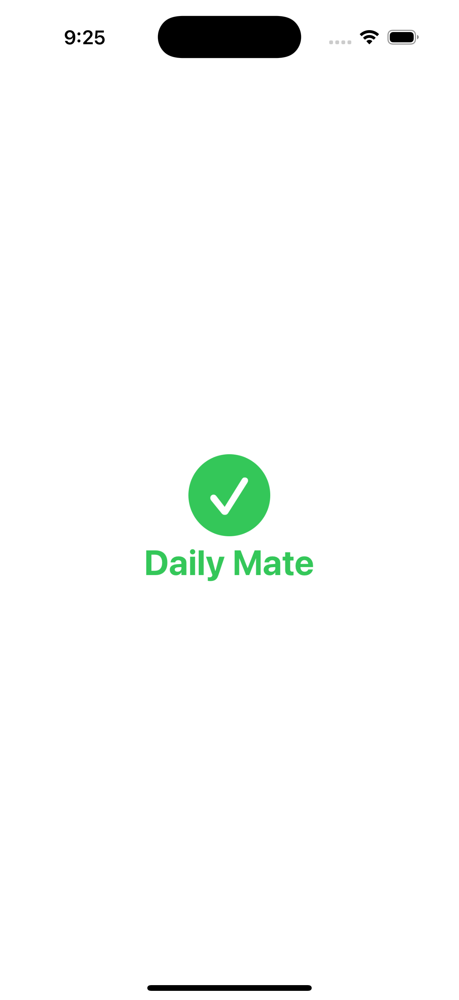

# Daily Mate

Daily Mate는 일상의 계획과 회고를 기록하는 iOS 앱입니다. 매일의 우선순위, 일정, 좋았던 점과 아쉬웠던 점을 기록하여 하루를 더 의미있게 만들어줍니다.

## 스크린샷

## Figma 디자인 초안

## 주요 기능

### 1. 일일 기록 관리

- 날짜별 기록 생성 및 관리
- 하루 단위로 하나의 기록만 생성 가능
- 날짜별 목록 확인 및 상세 보기

### 2. 우선순위 관리

- 하루의 우선순위 항목 추가/수정
- 순서대로 우선순위 표시
- 터치로 간편한 수정

### 3. 일정 관리

- 시작 시간과 종료 시간 설정
- 일정 내용 및 달성도(점수) 기록
- 시간순 정렬 및 표시

### 4. 하루 회고

- 좋았던 점 기록
- 아쉬웠던 점 기록
- 간편한 수정 및 삭제 기능

### 5. 행운의 메시지

- 랜덤 행운 메시지 제공
- 사용자에게 동기부여 메시지 전달

## 기술 스택

- SwiftUI
- SwiftData

## 주요 구현사항

- SwiftData를 활용한 영구 데이터 저장
- 커스텀 뷰 컴포넌트 구현
- 직관적인 사용자 인터페이스
- 스플래시 화면 애니메이션

## 개발 환경

- Xcode 16.2
- iOS 18.0
- Swift 6

## 라이센스

이 프로젝트는 MIT 라이센스를 따릅니다.

